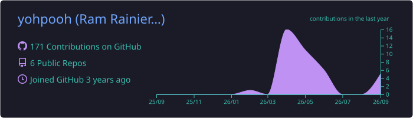
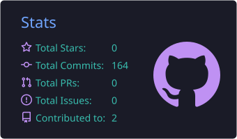
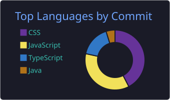

### Ram Rainier Masubay Belleza · a.k.a. **yohpooh**

📍 Philippines &nbsp;•&nbsp; 📱 Mobile & Web &nbsp;•&nbsp; 💻 Software Developer

<!-- Replace YOUR_HANDLE with your Instagram username -->

---

## 🙋‍♂️ About Me

I'm a Software Developer who turns ideas into user-centered products, from mobile apps to full‑stack platforms. I focus on practical, maintainable solutions, rapid iteration, and thoughtful UX — building, testing, and shipping features that solve real problems. I enjoy prototyping new ideas, exploring emerging technologies, and improving systems through automation and performance tuning. I also contribute to open-source, mentor junior developers, and collaborate cross-functionally to transform concepts into polished, reliable products.

- 🔭 Currently building **Sundo**, a scheduled ride-booking platform for Philippine motorcycle transport
- 🎮 Also working on **Tianac**, my own 2D platformer game
- 📱 Focused on **React Native / Expo** for mobile and **React + Node** on the web
- 🌱 Leveling up in backend architecture: **NestJS, PostgreSQL/PostGIS, Redis, BullMQ**
- 🤝 Open to **developer roles** and collaborations
- ⚡ Fun fact: I've shipped code in both **Delphi** and **React**, so I've seen both ends of the timeline

---

## 🚀 Featured Projects

<!-- Swap each "#" below for the repo or live link when it's ready -->

| Project                            | What it is                                                                                                                                                           | Built with                                                              |
| ---------------------------------- | -------------------------------------------------------------------------------------------------------------------------------------------------------------------- | ----------------------------------------------------------------------- |
| 🏍️ **[Sundo](#)**                  | Scheduled, contract-based ride booking for the Philippine motorcycle transport market — currently under development. A two-sided marketplace for drivers and riders. | React Native, Expo, NestJS, PostgreSQL/PostGIS, Redis, BullMQ, Supabase |
| 💸 **[Wassub!](#)**                | A mobile app that keeps track of all your subscriptions so nothing renews behind your back.                                                                          | React Native, Expo, Tailwind CSS                                        |
| 🏛️ **[AryzanAES](#)**              | Branding and website for an architecture/design studio.                                                                                                              | Vite, React, Tailwind CSS, Framer Motion, Supabase                      |
| 🎮 **[Tianac](#)** _(in progress)_ | A 2D platformer game I'm currently building. Art and animations created with Aseprite; game engine: Godot.                                                           | Aseprite, Godot                                                         |
| 💈 **[TrimTrak](#)**               | A booking app for barbershops that lets customers reserve their cut ahead of time (same stack as Wassub!).                                                           | React Native, Expo, Tailwind CSS                                        |

---

## 🧰 Tech Stack

**Languages & Frameworks**

  
  
  
  
  
  
  
  
  
  
  
  

**Backend, Data & Tools**

  
  
  
  
  
  
  

**Currently building with**

  
  &nbsp;
  

---

## 📊 GitHub Stats

<!-- These cards are generated by the GitHub Action in .github/workflows/profile-summary-cards.yml -->

---

**Thanks for stopping by!** If something here interests you, let's talk. ✨

<a href="mailto:bramrainier@gmail.com">📧 bramrainier@gmail.com</a> &nbsp;•&nbsp; <a href="https://ramrainierbelleza.netlify.app">🌐 Portfolio</a>

